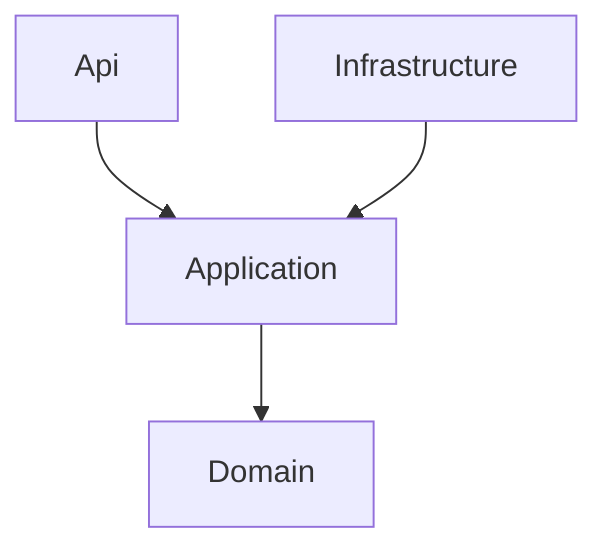

# Backend: Clean Architecture (Expenses service)

## Obiettivo

Separare responsabilità e dipendenze:

- **Domain** contiene le regole e i modelli di business.
- **Application** contiene use-case (commands/queries) e contratti (es. repository interface).
- **Infrastructure** implementa dettagli tecnici (EF Core, persistence, repository concreti).
- **Api** espone HTTP endpoints e gestisce mapping/trasporto (DTO).

Dipendenze (direzione):

## Struttura cartelle (server/services/expenses)

- `Expenses.Api/`
  - `Program.cs` bootstrap (DI, auth, CORS, swagger)
  - `controllers/` controller REST
  - `dto/` request/response DTO

- `Expenses.Application/`
  - `commands/` use-case “write” (MediatR)
  - `queries/` use-case “read” (MediatR)
  - `repositories/` contratti (es. `IRepository<T, TKey>`)
  - `DependencyInjection.cs` registrazione MediatR + FluentValidation

- `Expenses.Domain/`
  - `Entities/` entità principali (`Transaction`, `Category`, enums)
  - `ValueObjects/` (es. `Currency`)

- `Expenses.Infrastructure/`
  - `persistence/` `TransactionsDbContext` + EF configurations
  - `repositories/` implementazioni (es. `EfRepository<,>`)
  - `Migrations/` migrazioni EF
  - `DependencyInjection.cs` registrazione DbContext + repository

## CQRS (pragmatico)

Il progetto usa una separazione pratica:

- **Commands**: creazione/aggiornamento/cancellazione (scrittura)
- **Queries**: lettura

Entrambi passano tramite **MediatR**.

Esempio:

- `CreateTransactionCommand` (Application) → `CreateTransactionHandler` → `IRepository<Transaction,long>`
- `GetTransactionsQuery` (Application) → `GetTransactionsHandler` → `IRepository<Transaction,long>`

## Validazione

In Application è registrato **FluentValidation** che scansiona l’assembly.

- I validator vivono vicino a command/query.
- Le eccezioni di validazione vengono catturate nei controller e trasformate in `400 BadRequest`.

## Persistence e repository

- EF Core via `TransactionsDbContext`.
- Mapping fatto con `ApplyConfigurationsFromAssembly` (file in `persistence/configurations`).
- Repository generico `EfRepository<TEntity,TKey>`:
  - `GetAllAsync()` e `GetByIdAsync()` filtrano `Status == 0` (soft delete).

## Soft delete

`Category` e `Transaction` espongono `Status` e un metodo `Delete()` che imposta `Status = 1`.

A livello di repository, la lettura filtra per `Status == 0`.

## Multi-tenant / user scope

Nelle entità esistono `TenantId` e `UserId`.

Nel backend attuale alcuni endpoint hanno ancora valori fissi (es. `1, 1`) anziché estrarre le claim dal token.
La direzione “finale” è:

- estrarre `sub` (user id) e una claim custom (es. `tenantId`) dal JWT
- applicare i filtri nei query/command handler (o a livello repository)

## Bootstrap (Api)

In `Expenses.Api/Program.cs`:

- CORS per dev Angular (`http://localhost:4200`)
- JWT bearer auth verso realm `myapp` (Keycloak)
- DI: `AddApplication()` + `AddInfrastructure(...)`
- Swagger/OpenAPI
