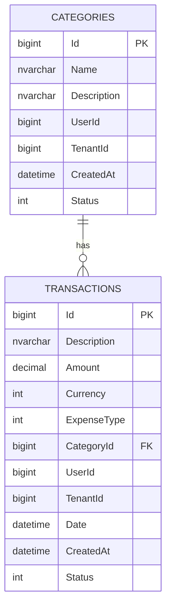

# Expenses microservizio — modello dati

## Goal

Gestire:

- **Categorie** di spesa/entrata
- **Transazioni** (spese/entrate) con importo, valuta, data e categoria

Il servizio è pensato per essere **multi-tenant** e **user-scoped** tramite `TenantId` e `UserId`.

## Domain model (riassunto)

### Entities

- `Category`
    - `Id: long`
    - `Name: string` (required, max 100)
    - `Description: string?` (max 500)
    - `UserId: long`
    - `TenantId: long`
    - `CreatedAt: DateTime`
    - `Status: int` (soft delete)

- `Transaction`
    - `Id: long`
    - `Description: string?` (max 500)
    - `Amount: Money` (value object “owned”, persistito come colonne)
    - `ExpenseType: TransactionType` (`Expense`/`Income`)
    - `UserId: long`
    - `TenantId: long`
    - `CategoryId: long` (FK)
    - `Date: DateTime`
    - `CreatedAt: DateTime`
    - `Status: int` (soft delete)

### Value objects / enums

- `Money`
    - `Amount: decimal(18,2)`
    - `Currency: Currency` (enum)

- `Currency` (enum): `EUR`, `USD`, ...
- `TransactionType` (enum): `Expense`, `Income`

## Soft delete

Entrambe le tabelle usano `Status`:

- `0` = attivo
- `1` = cancellato

Le query del repository EF filtrano `Status == 0` per le letture.

## Database (ER diagram)

Riferimento: EF Core migrations / model snapshot in `Expenses.Infrastructure`.

## Vincoli e note implementative

- Relazione: `Transactions.CategoryId -> Categories.Id` con `DeleteBehavior.Restrict`.
- `Money` è mappato come owned type: in DB finisce come colonne `Amount` e `Currency` dentro `Transactions`.
- `Currency` è un enum: attualmente è persistito come `int` (vedi snapshot EF).
- In `CategoryConfiguration` non è configurato esplicitamente `TenantId/UserId`, ma risultano comunque colonne in DB perché presenti nell’entità.
